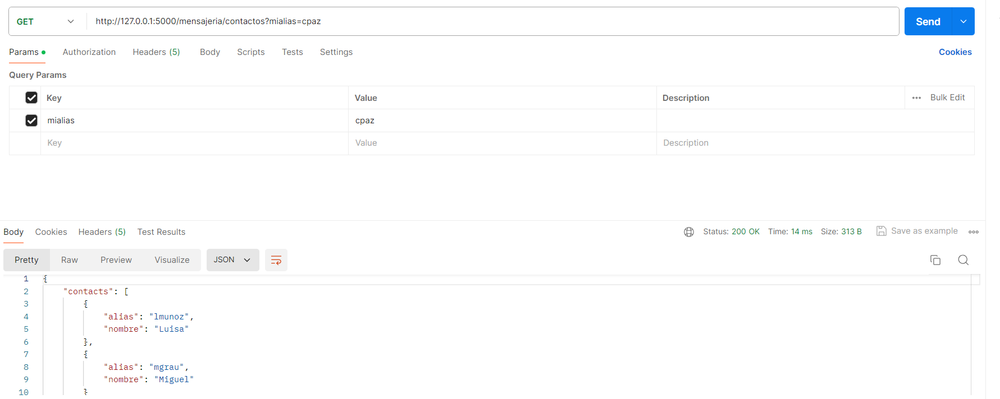
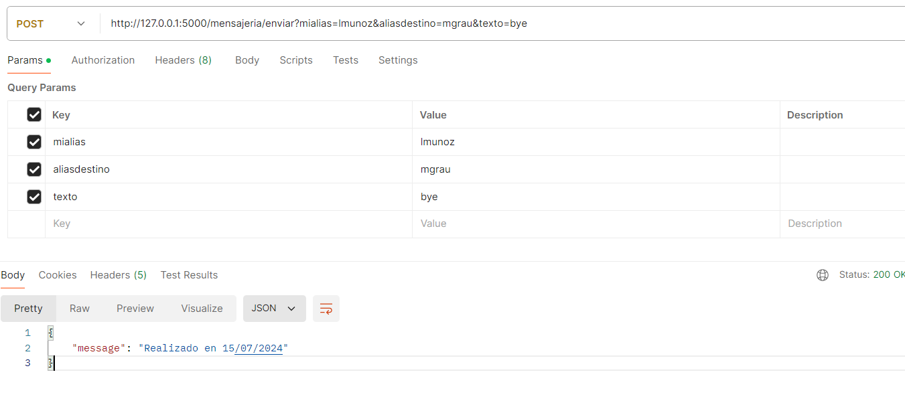
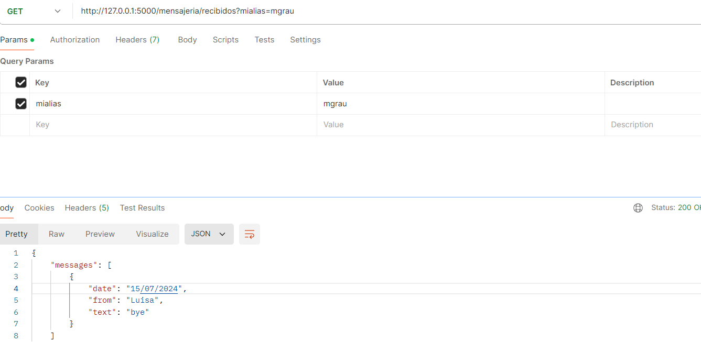

# Practicando_Final_Software
## Caso de estudio
Desarrollar un software que implemente un sistema de mensajeria.
Se debe soportar las operaciones:

-	Contactos: Lista los contactos de un alias con su nombre.
-	Enviar Mensaje: Envía un mensaje de texto a un contacto (validar que esté en la lista de contactos)..
-	Mensajes Recibidos: Muestra la lista de mensajes recibidos por el usuario

### Pregunta 1
En un repositorio Github, desarrollar el código fuente (se recomienda usar Python, pero no es obligatorio) que implemente los endpoints:


```
/mensajeria/contactos?mialias=XXXX
/mensajeria/enviar?mialias=XXXX&aliasdestino=YYYY&texto=ZZZZ
/mensajeria/recibidos?mialias=XXXX
```
***Comprobamos que el code si funciona***
- Get: Contactos
<p align="center">
  
</p>

- Post: Envio
<p align="center">
  
</p>

- Get: Recibidos
<p align="center">
  
</p>

Archivos: 
```
app.py
data.py
requirements.txt
```

**NOTA**: Para no realizar las pruebas en postman, podemos usar el archivo `test_endpoints.py`

### Pregunta 2 (4 puntos)

Realizar 4 pruebas unitarias para un caso de éxito y tres de error. Incluir las pruebas unitarias en el mismo repositorio Github.

Adicionar comentarios en cada prueba indicando el caso de prueba.

`Archivo test_app.py `


### Pregunta 3 (4 puntos)

Se requiere realizar un cambio en el software para realizar “broadcast” a todos los contactos. Adicionalmente se debe contabilizar el número de mensajes y “cobrar” un valor por mensaje.

Qué cambiaría en el código (Clases / Métodos) - No implementación.
Nuevos casos de prueba a adicionar.
Cuánto riesgo hay de “romper” lo que ya funciona?

#### Cambios
1. **Método send_message:**

Modificar para permitir el envío de mensajes a múltiples contactos en lugar de un solo destinatario.
Añadir un contador para llevar el número total de mensajes enviados.

2. **Nuevo Método broadcast_message:**

Implementar un nuevo método que maneje el "broadcast" a todos los contactos de un remitente.
Este método debería iterar sobre la lista de contactos y llamar a send_message para cada uno.

3. **Añadir lógica de "cobro":**

Introducir una variable para definir el costo por mensaje y calcular el costo total basado en la cantidad de mensajes enviados.

#### Casos de Prueba
1. Éxito: Envío de mensajes a todos los contactos al mismo tiempo.
2. Error: El contador de mensajes no registre todos los mensajes enviados.
3. Error: No se calcule de manera correcta los costos.
4. Error: Broadcast a constactos vacíos.

#### Riesgo de "romper" lo que ya funciona
Existe demasiado riesgo de romper lo que ya funciona si el nuevo método de "broadcast" se implementa de manera que interfiera con el flujo actual de envío de mensajes. Es decir, si lo implementamos en el archivo app.py, tenemos que asegurarnos que todas los métodos mencionados anteriormente también se enecuentren implementados.

